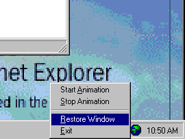



## Animated Icons in System Tray

### Description

There have been many samples that show how to place an icon on the system tray. I even used one of those as the source for this example. I did make some changes and there was one major change. It allows the use of ANIMATED CURSORS. Yes, you can now animate your icon on the system tray. It took me several days to figure out how to do this. I am working on a new version now which removes the need for the image list control. For now, just check it out and PLEASE vote for me. I would love to win for a change.
 
### More Info
 

             |
---                |---
**Submitted On**   |2001-08-09 14:08:10
**By**             |[Todd Herman](https://github.com/Planet-Source-Code/PSCIndex/blob/master/ByAuthor/todd-herman.md)
**Level**          |Advanced
**User Rating**    |4.7 (194 globes from 41 users)
**Compatibility**  |VB 6\.0
**Category**       |[Complete Applications](https://github.com/Planet-Source-Code/PSCIndex/blob/master/ByCategory/complete-applications__1-27.md)
**World**          |[Visual Basic](https://github.com/Planet-Source-Code/PSCIndex/blob/master/ByWorld/visual-basic.md)
**Archive File**   |[Animated I24343892001\.zip](https://github.com/Planet-Source-Code/todd-herman-animated-icons-in-system-tray__1-26016/archive/master.zip)

### API Declarations

Several used but all defined in the CSysTray class.

